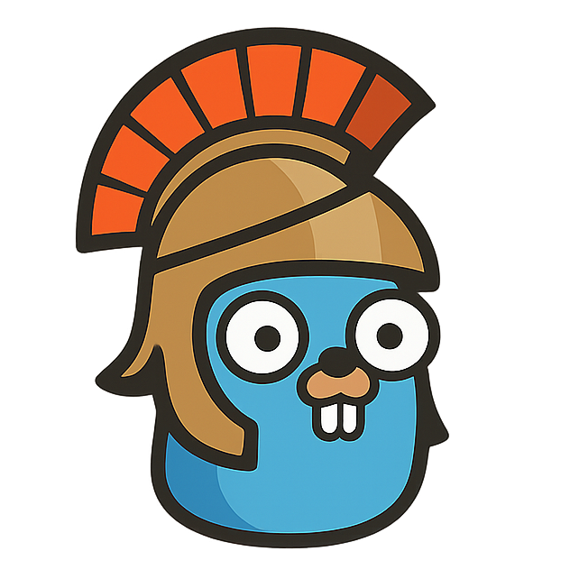

# GoStrategy



Open-source implementation of the classic Stratego board game. Built with a high-performance Go backend and a modern SvelteKit frontend, designed for both Human-vs-AI and AI-vs-AI experimentation.

Play the game here: https://gostrategy.dotsem.be

Or run it yourself locally: [see "Running with Docker (Recommended)"](#running-with-docker-recommended).

## Project Overview

This project aims to provide a robust platform for playing GoStrategy while serving as a testing ground for various AI strategies. It features real-time gameplay via WebSockets, secure user authentication, and a declarative infrastructure managed via NixOS.

### Tech Stack
- **Backend**: Go (Gin, Gorilla WebSocket)
- **Frontend**: SvelteKit 5 (Runes, Tailwind CSS)
- **Database**: PostgreSQL 15
- **Infrastructure**: NixOS, Docker, Cloudflare Tunnels
- **Monitoring**: Loki, Promtail

## Getting Started

### Prerequisites
- Docker and Docker Compose
- Bun (for local frontend development)
- Go 1.25+ (for local backend development)

### Running with Docker (Recommended)
The easiest way to get the full stack running is using docker compose:
```bash
docker compose up
```
This will spin up the backend, frontend, and database containers. The app will be available at `http://localhost:5000`.

### Local Development
If you prefer running services outside of Docker:

**Backend:**
```bash
cd code/backend
go run main.go --server
```

**Frontend:**
```bash
cd code/frontend
bun install
bun run dev
```
or use pnpm:
```bash
cd code/frontend
pnpm install
pnpm dev
```

### Simulate AI vs AI Games

```bash
go run main.go --ai={ai1}:{ai2} --format md --logging=false --matches {n}
```
Herby you can replace {ai1} and {ai2} with any AI type available in the codebase.
Replace n with the amount of matches you want to run.

Example:
```bash
go run main.go --ai=fafo:fato --format md --logging=false --matches 100
```

## Architecture & Performance

### High-Performance Concurrency
The backend uses an event-driven architecture with Go channels to manage game states. This ensures minimal mutex contention and high throughput for concurrent matches.

## AI Experimentation

One of the core goals is the development of a comprehensive AI test suite. Current supported AI types:
- **FAFO**: Random move generator.
- **FATO**: Random move generator with basic memory to avoid loops.

Planned additions include Heuristic-based evaluation, MiniMax, and Monte Carlo Tree Search (MCTS). Detailed results of AI matches can be found in the [AI Data folder](documents/files/ai-data/).

## Documentation
- [Changelog](CHANGELOG.md) - Project history and versioning.
- [Roadmap](ROADMAP.md) - Future plans and hardening steps.
- [API Documentation](http://localhost:8080/swagger/index.html) - Swagger UI (available when running locally).

## Contributing
- [Contributing Guide](CONTRIBUTING.md) - Guidelines for contributing to the project.

## License
This project is licensed under the MIT License - see the [LICENSE](LICENSE) file for details.
